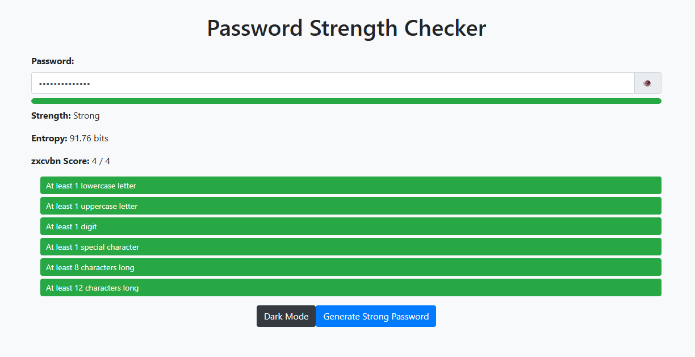

# 🔐 Advanced Password Strength Checker & Generator


> A professional-grade, client-side password security tool that evaluates strength using **Information Entropy**, **Rule-based Validation**, and the industry-standard **zxcvbn** algorithm.



## 🚀 Live Demo
[**Click here to view the live project**](#) *(Add your GitHub Pages link here)*

---

## 🧐 Overview
This isn't just a simple regex checker. This project combines multiple security metrics to give users a realistic analysis of their password's resistance to brute-force and dictionary attacks. It features a modern, responsive UI built with **Bootstrap 4** and includes a **Dark Mode** for better accessibility.

### Why is this "Advanced"?
1.  **zxcvbn Integration:** It uses Dropbox's open-source estimator to detect common patterns (names, dates, keyboard walks).
2.  **Entropy Calculation:** It calculates the mathematical randomness of the password in bits.
3.  **Blacklist Detection:** It instantly flags top common passwords (e.g., "admin", "123456").

---

## ✨ Key Features

* **🛡️ Multi-Layer Analysis:** Checks length, character variety, and dictionary words simultaneously.
* **📊 Real-time Visual Feedback:** Dynamic progress bar and specific condition checklists (Upper, Lower, Digit, Special).
* **🧮 Entropy Meter:** Displays the raw bit strength ($E = L \times \log_2 R$).
* **⚡ Smart Password Generator:** One-click generation of cryptographically strong, shuffled passwords.
* **👁️ Privacy Controls:** Toggle password visibility with the eye icon.
* **🌙 Dark Mode:** Fully integrated dark theme for low-light usage.
* **🚫 Blacklist Protection:** Prevents users from using notoriously weak passwords.

---

## 🛠️ Tech Stack

* **Frontend:** HTML5, CSS3, JavaScript (ES6)
* **Framework:** Bootstrap 4.3.1 (Responsive Design)
* **Library:** jQuery 3.3.1 (DOM Manipulation)
* **Security Library:** [zxcvbn.js](https://github.com/dropbox/zxcvbn) (4.4.2)

---

## 📂 Project Structure

```bash
password-strength-checker/
│
├── index.html        # Main application structure (Bootstrap grid)
├── style.css         # Custom styling, animations, and Dark Mode logic
├── script.js         # Core logic: Entropy calc, Event listeners, Generator
└── README.md         # Project documentation